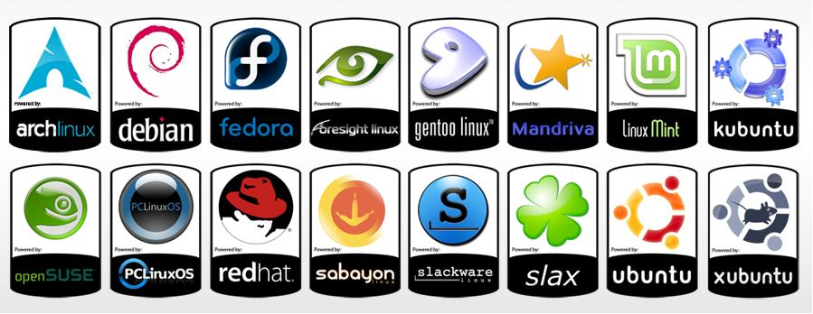

## Découverte du système
 
Pôle sup de La Salle

Florent Vuillemin

xxx

### How it started

```txt
Linus Benedict Torvalds
25 août 1991, 22:57:08


Hello everybody out there using minix -

I'm doing a (free) operating system (just a hobby, won't be big and
professional like gnu) for 386(486) AT clones. This has been brewing
since april, and is starting to get ready. I'd like any feedback on
things people like/dislike in minix, as my OS resembles it somewhat
(same physical layout of the file-system (due to practical reasons)
among other things).

I've currently ported bash(1.08) and gcc(1.40), and things seem to work.
This implies that I'll get something practical within a few months, and
I'd like to know what features most people would want. Any suggestions
are welcome, but I won't promise I'll implement them :-)

Linus (torvalds@kruuna.helsinki.fi)

PS. Yes - it's free of any minix code, and it has a multi-threaded fs.
It is NOT protable (uses 386 task switching etc), and it probably never
will support anything other than AT-harddisks, as that's all I have :-(. 
```

---

#### Le noyau Linux

- Un noyau  de système d’exploitation développé par Linus Torvalds depuis 1991
- Appartient à la famille des Unix (norme POSIX)
- Multi-utilisateurs, multi-tâches
- Modulaire


---

#### Le système GNU/Linux

- Fondé en 1984 par Richard Stallman
- Un ensemble de logiciels (libres) compatibles Unix
  - Compilateur : `gcc`
  - Bibliothèque de fonctions : `glibc`
  - Editeur de texte : `GNU Emacs`
  - Commandes de base : `GNU Coreutils`
- Une licence : GNU General Public License (GPL)

---

#### Richard Stallman


---

#### Un peu d'architecture


xxx

### Le système GNU/Linux

Un noyau

Des programmes

et...

---

#### Les environnements de bureau

<div id="left">

L’interface graphique permettant de manipuler le système
- Gnome
- Kde
- Xfce
- Lxde
- Enlightment...

Et CDE ➡

</div>

<div id="right"> <!-- .element: class="fragment" -->

 

</div>

---

#### Distributions

- Un noyau, des modules
- Des programmes dans des versions précises
- Personnalisés et intégrés 



---

#### Distributions (avec troll)


xxx

### Les processus

<div id="left">

- Un identifiant unique (PID)
- A les droits d’un utilisateur et d’un groupe
- Une relation de descendance
- Fork = Duplication
- Exec = Remplacement du processus

</div>

<div id="right"> <!-- .element: class="fragment" -->


</div>

---

### Les processus

 <!-- .element: style="height: 800px" -->

---

### Le système de fichiers

- Un arbre unique dont la racine est `/`
- Les éléments du chemin sont également séparés par le caractère `/`
- Exemple de chemin : `/home/jono/work`


---

### Le système de fichiers

- Les **points de montage** sont des répertoires contenant l’arborescence de fichiers d’un périphérique (physique ou virtuel)


---

### TP 1

- Les environnements de bureau
- Les processus
- Le système de fichiers
