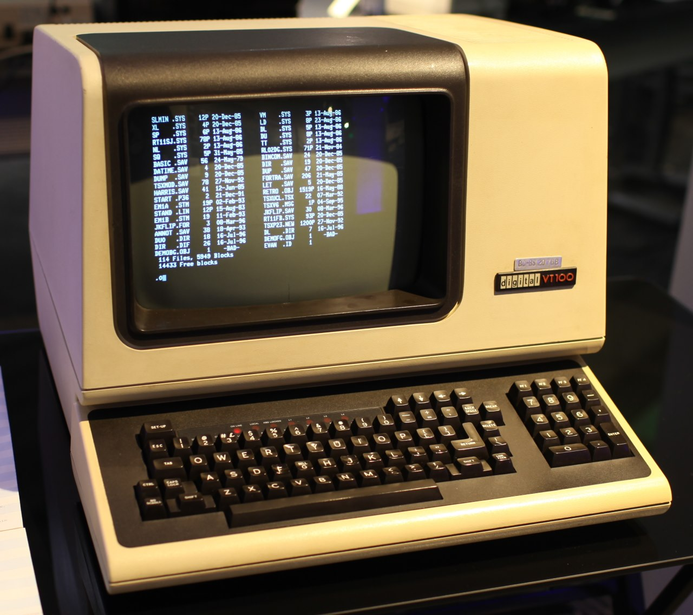
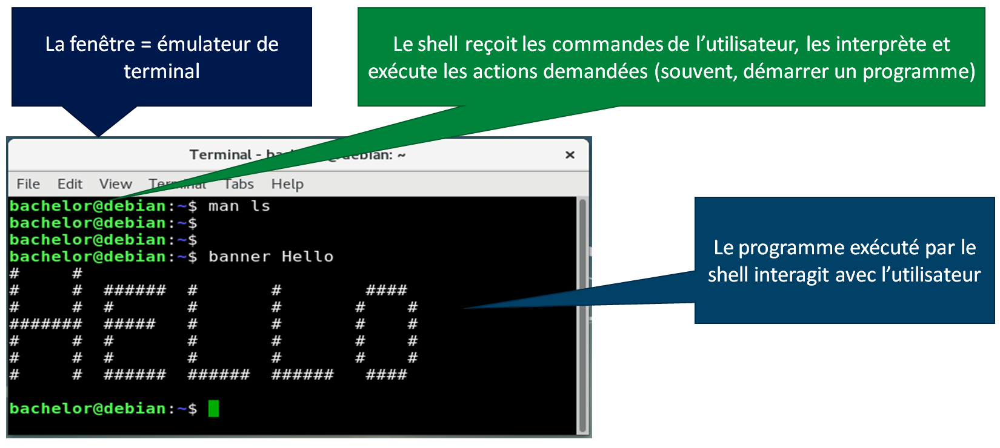
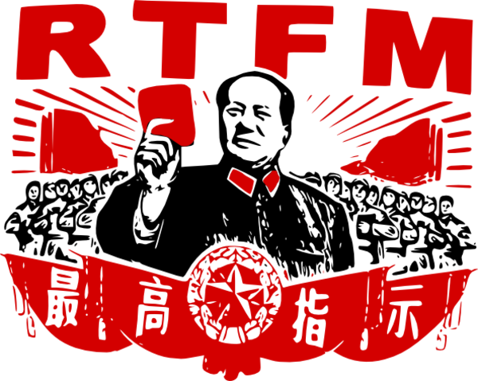
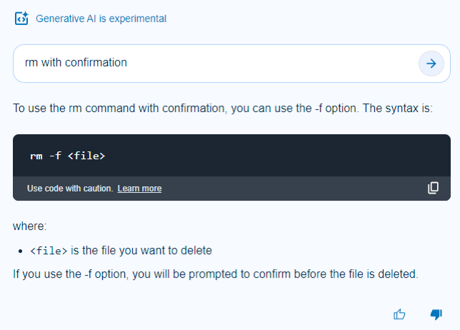
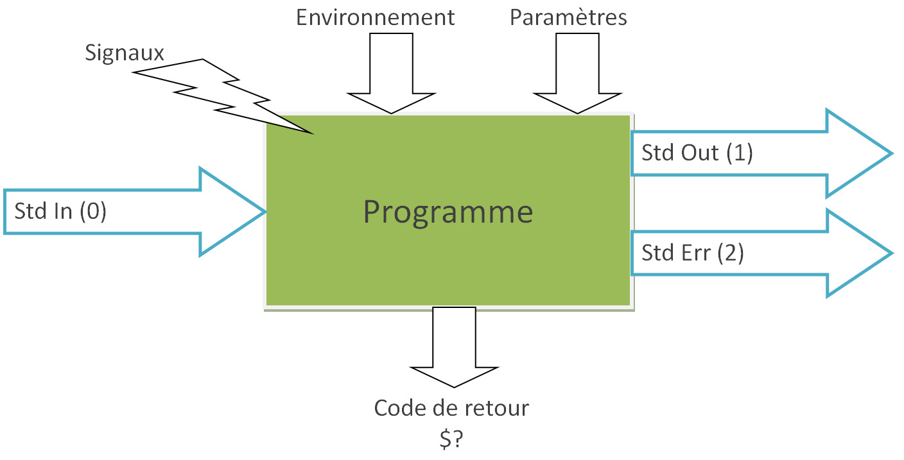
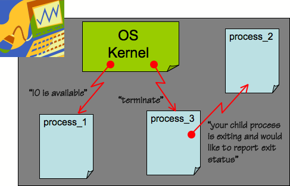
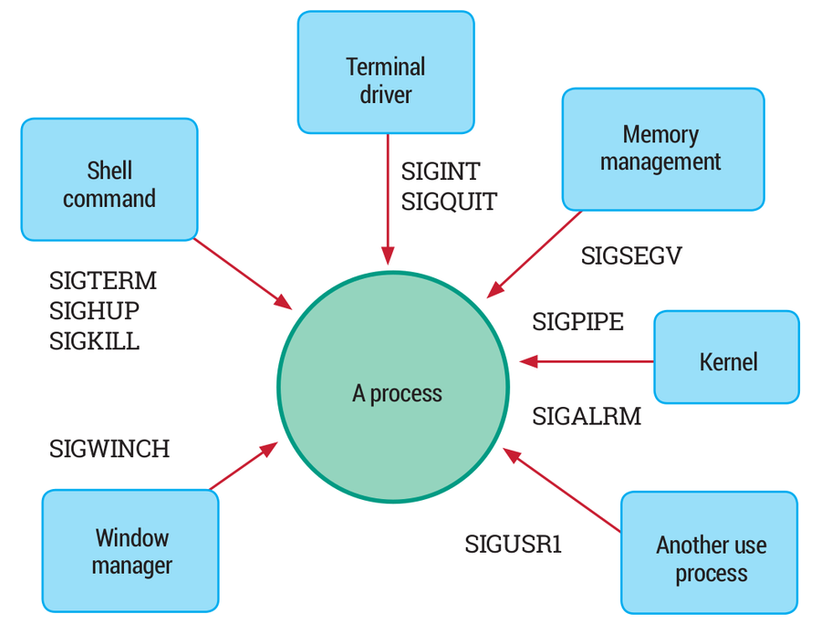

## Découverte de la ligne de commande
 
### `$`

xxx

### D'où vient le terminal ?



---

#### Comment ça marche ?



---

#### Le terminal

- Gère le fenêtrage (taille, icônes... )

- Gère l'affichage (police, taille, couleurs... )

- Exécute un programme lorsqu'on l'ouvre

---

#### Le shell

<div id="left">

- Ils sont nombreux : sh, ash, bash, ksh, csh…
- Nous utiliserons bash : Bourne-again Shell (GNU)
- Certaines commandes sont intégrées, d’autres sont des programmes de la machine

</div>

<div id="right">

Fonctions :
- Auto-complétion (Tab)
- Jokers (`*`)
- Pipeline (`|`)
- Substitution de commandes (\`\`)
- Variables (`$`)
- Boucles et structures de contrôle (for, if…)

</div>

---

#### Trouver de l'aide

<div id="left">

```sh
<commande> --help
man [<section>] <commande>
whatis <commande>
apropos <mot-clé>
```

Et le classique :



</div>

<div id="right">

| Section | Description |
|-|-|
| 1 | Commandes générales |
| 2 | Appels système |
| 3 | Fonctions de la bibliothèque standard (libc) |
| 4 | Fichiers spéciaux et périphériques |
| 5 | Formats de fichiers et conventions |
| 6 | Jeux et écrans de veille |
| 7 | Misc |
| 8 | Commandes d'administation et démons |

</div>

---

#### Méfiez-vous de ChatGPT



---

### TP 2, première partie

- Découvrir la console et le shell
- Manipuler des fichiers
- Le rôle du `$PATH`

xxx

### Entrées, sorties et signaux

---

#### Les flux



---

#### Les signaux



---

#### Les signaux

- Chaque processus peut choisir de traiter / retarder / masquer certains signaux
- Sinon, une action par défaut est effectuée
- Liste : http://mat.free.free.fr/downloads/unix/signaux.pdf
- Ou : `man 7 signal`



---

#### TP 2, suite

- Entrée et sorties standard, redirection de flux
- Codes de retour
- Envoi et réception de signaux
- Paternité des processus
