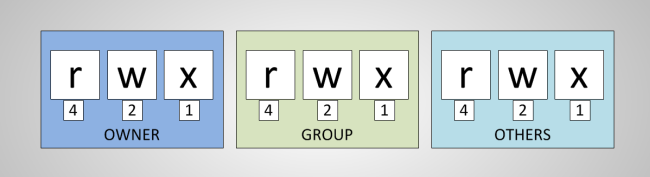

## Droits d'accès
 


---

### Gestion des utilisateurs


---

### Les types de fichiers

<div id="left">

 <!-- .element height="400" -->

</div>

<div id="right">

| Section | Description |
|-|-|
| - | Fichier standard |
| d | **Directory**, répertoire |
| l | **Link**, lien symbolique |
| p | **Pipe**, tube nommé créé avec `mkfifo` |
| c | **Character**, périph. de type caractère |
| b | **Block**, périph. de type bloc |

</div>

---

### Les droits d'accès

`crw-rw-rw- 1 root root      1,   3 août  21 15:15 null`

 <!-- .element height="350" -->

---

### Les bits de mode étendu

* SetUID / SetGID : L’utilisateur qui exécute ce programme obtient les droits du propriétaire/du groupe du fichier

```sh
$ ls -l my_script 
-rwsr-sr-x 1 owner group 158998 mar 12 17:12 my_script
```

* C’est la différence entre l’utilisateur/groupe réel et effectif

---

### Le sticky bit

* Sticky bit : sur un répertoire, il interdit aux utilisateurs de supprimer les fichiers des autres, même s’ils ont les droits en écriture

```sh
$ ls -l / | grep tmp
drwxrwxrwt  7 root root      180 Sep  6 23:05 tmp
```

---

### Définir les droits d'accès

- Octal :
  - `chmod 600 key_rsa`
  - `chmod 755 install_script.sh`

- Représentation symbolique :
  - `chmod a+x install_script.sh`
  - `chmod g+rw,o-rw my_group_report`

---

### L'utilisateur root

* Un compte spécial UID=0, GID=0
* Ne subit pas les contraintes d’accès des autres utilisateurs

* Mais n'a pas forcément toutes les permissions non plus (capabilities)

---

### Les `sudoers`

* Basé sur la commande sudo (pas toujours installée)
* Permet d'accorder le droit root sur un périmètre réduit :
  * Certains utilisateurs
  * Certains groupes (par exemple wheel)
  * Pour lancer certaines commandes


---

### TP 3

- Droits sur les fichiers
- Le compte root
- Gestion des utilisateurs
- Modes étendus

_Ne passez pas root si ce n'est pas demandé !_


