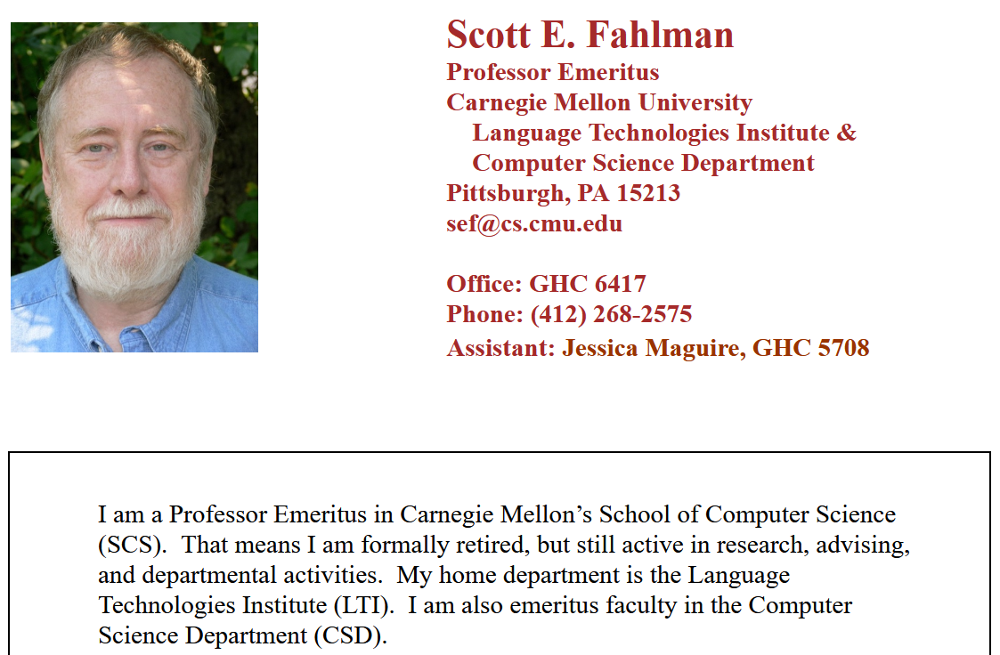

## Scott E. Fahlman
 
```txt
19-Sep-82 11:44    Scott E  Fahlman             :-)
From: Scott E Fahlman <Fahlman at Cmu-20c>
 
I propose that the following character sequence for joke markers:

:-)
        
Read it sideways.  Actually, it is probably more economical to mark
things that are NOT jokes, given current trends.  For this, use
        
:-(
```

---

### Sa page perso

http://www.cs.cmu.edu/~sef/



---
